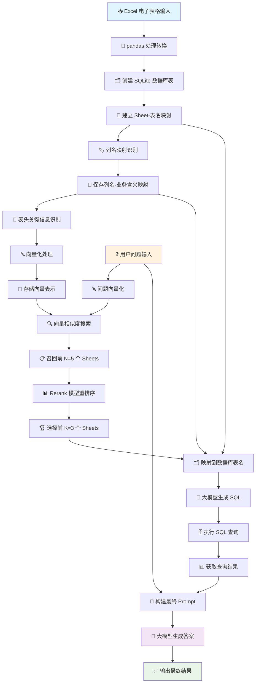

**优化后的 NL2DB 应用流程（处理多 Sheet Excel 并映射到数据库）：**

# 📊 NL2DB 系统流程详解

## 🔄 核心处理流程

### 1. 📥 **数据输入阶段**
> **传入 Excel 电子表格**

---

### 2. 🔄 **数据转换阶段**
> **将 Excel 电子表格用 pandas 处理，转换为 SQLite 数据库表，并保存到 SQLite 文件中**

- 📖 使用 `pandas` 读取 Excel 文件的所有 Sheets
- 🗂️ 为每个 Sheet 创建对应的数据库表，表名基于excel名+ Sheet 名
- 🔗 建立 **Excel Sheet 名称** 到 **SQLite 数据库表名** 的映射关系

---

### 3. 🏷️ **列名映射阶段**
> **为每个数据库表建立列名映射关系**

对于每个数据库表：
- 📋 从 SQLite 数据库中获取该表的列名
- 🤖 使用大模型和 Prompt 识别这些列名的业务含义（如日期、产品名称、价格等）
- 🔗 建立 **列名** 到 **业务含义** 的映射关系
- 💾 保存列名—业务含义映射配置文件

---

### 4. 🧠 **向量化阶段**
> **识别每个 Excel Sheet 的表头、关键信息并向量化**

对于 Excel 文件中的每个 Sheet：
- 🔍 使用大模型和 Prompt 识别该 Sheet 的表头（可能包含多行）
- 📌 识别该 Sheet 的关键信息（如日期范围、产品名称等）
- 🔤 将识别出的表头信息、关键信息组合成文本进行向量化
- 💾 存储 Sheet（及其对应的 Excel 文件名和 Sheet 名）的向量表示，并关联到原始表头信息以及对应的数据库表名

---

### 5. 🔍 **向量检索阶段**
> **根据用户的问题 (query)，使用向量查询并召回排名前 N=5 的 Excel Sheets**

- 🔤 将用户的问题 (query) 向量化
- 🔍 使用向量相似度搜索，从存储的向量数据库(Excel sheet的表头及关键信息)中召回最相关的 N=5 个 Excel Sheets

---

### 6. 📊 **重排序阶段**
> **使用 Rerank 模型对召回的 Excel Sheets 进行重排序，取前 K=3 个**

- 🎯 使用 Rerank 模型，根据用户的问题和召回的 Excel Sheets，对它们的相关性进行更精确的评估和排序
- 🏆 选择排名靠前的 K=3 个 Excel Sheets

---

### 7. 🛠️ **SQL 构建阶段**
> **映射到数据库表并构建 SQL 查询**

- 🗂️ 对于前 K 个召回的 Excel Sheets，使用之前建立的映射关系，找到它们对应的 SQLite 数据库表名
- 📝 将用户的问题以及这些相关的数据库表名和它们的列名（作为 Schema 信息）提供给大模型
- ⚠️ **重要提示**：因为数据库列名可能为空，类似于"Unnamed:0","Unnamed:1"这种，所以在大模型生成SQL语句时，需要用到列名映射为业务含义的配置文件，才能生成正确的SQL语句
- 🤖 构建prompt，指示大模型根据这些信息生成 SQL 查询语句

---

### 8. 🗄️ **数据查询阶段**
> **查询数据库表，得到结果**

- 🔌 连接到 SQLite 数据库
- ⚡ 执行生成的 SQL 查询，从对应的数据库表中获取结果

---

### 9. 🎯 **答案生成阶段**
> **将结果作为上下文 (context) 和用户的问题 (query) 以及相关的表结构信息结合生成 prompt，给到大模型**

- 📝 构建一个 Prompt，包含用户的问题、数据库查询结果
- 🤖 指示大模型根据这些信息生成自然语言的最终答案

---

### 10. ✅ **输出结果阶段**
> **得到大模型的最终答案**

---

## 📈 系统流程图

---

## 🔧 技术要点

- **🔄 数据流转**：Excel → SQLite → 向量数据库 → SQL 查询 → 自然语言答案
- **🧠 AI 组件**：大模型用于列名识别、表头分析、SQL生成、答案生成
- **🔍 检索策略**：向量检索 + Rerank 重排序，确保高精度召回
- **🗂️ 映射机制**：多层映射关系保证数据准确性和可追溯性

