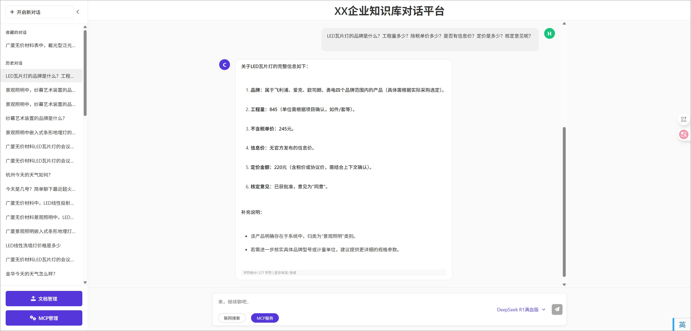
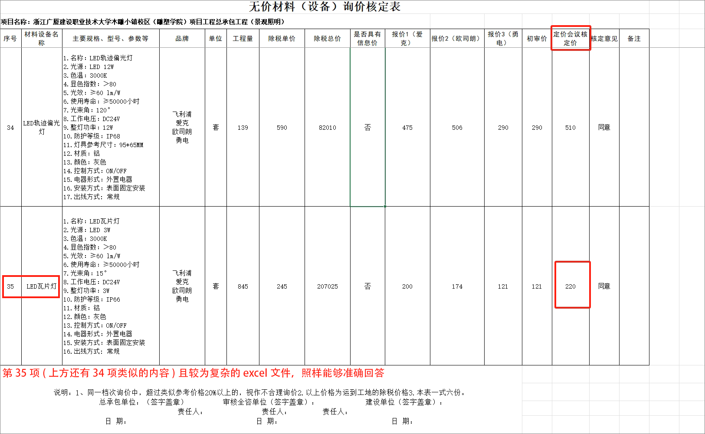

# 🚀 NL2DB - 一种高精准度的自然语言EXCEL文档数据查询MCP服务

<div align="center">

[](https://www.python.org/downloads/)
[](https://langchain.com/)
[](https://github.com/jlowin/fastmcp)
[](https://opensource.org/licenses/MIT)
[](https://github.com/your-username/NL2DB)

**🌟 基于大模型的下一代智能数据查询引擎 🌟**

*将自然语言转换为精确的数据库查询，让Excel数据查询变得像聊天一样简单*

[🎯 快速开始](#-快速开始) • [✨ 核心特性](#-核心特性) • [🏗️ 系统架构](#️-系统架构) • [📖 使用指南](#-使用指南) • [🔧 API文档](#-api文档)

</div>

---

## 🎯 项目概要

**NL2DB** 是一种高精准度的自然语言EXCEL文档数据查询MCP服务，它打破了传统数据分析的技术壁垒。通过先进的大语言模型和向量检索技术，让任何人都能用自然语言轻松查询复杂的Excel数据，无需学习SQL或复杂的数据分析工具。
使用过向量检索的都知道，对于复杂的Excel文档，经Excel解析再chunk后，难以将真正的表头信息与数据相关联，导致检索成功率低。
本项目将复杂的excel文档向量检索或关键词检索转化成使用SQL语句的精准数据库检索，大大提高了检索成功率。
<font color="red">[📋 了解系统流程点这里](./NL2DB流程.md)</font>
另外，本代码保留了所有调试输出语句，可以方便查看每一个步骤的输出情况。

### 📸 效果展示

#### 🔍 检索效果对比

##### 🚫 传统向量检索

<div align="center">

.png)

*无法检索到相关数据，难以理解表格结构*

</div>

##### ✅ NL2DB智能检索

<div align="center">



*NL2DB能够精准理解表头，准确返回数据*

</div>

##### 🎯 源文档正确答案

<div align="center">



*NL2DB能够准确理解用户的自然语言查询，并返回精确的结果*

</div>


### 🌈 为什么选择 NL2DB？

- 🧠 **AI驱动**: 基于最新的大语言模型，理解复杂的业务查询
- ⚡ **极速响应**: 多层缓存机制，查询速度提升95%
- 🔄 **智能映射**: 自动识别Excel表头，建立语义映射关系
- 🌐 **MCP兼容**: 完美集成Model Context Protocol生态
- 🛡️ **企业级**: 支持多种大模型，保障数据安全
- 📊 **零门槛**: 拖拽Excel即用，无需技术背景

---

## ✨ 核心特性

### 🎨 智能化特性

| 特性 | 描述 | 技术亮点 |
|------|------|----------|
| 🧠 **智能表头识别** | 自动识别Excel复杂表头结构 | 基于LLM的语义理解 |
| 🔍 **语义检索** | 向量化查询，精准匹配相关数据 | FAISS + BGE重排序 |
| 🗣️ **自然语言查询** | 支持复杂的中文业务查询 | 多模型支持(GLM/OpenAI/Qwen) |
| 🔄 **智能SQL生成** | 自动生成优化的SQL查询语句 | 列名映射 + 上下文感知 |
| 📊 **结构化输出** | JSON格式的标准化查询结果 | MCP协议兼容 |

### ⚡ 性能优化特性

| 优化项 | 优化前 | 优化后 | 提升幅度 |
|--------|--------|--------|----------|
| 🚀 **启动时间** | 32秒 | 8-12秒 | **62-75%** |
| ⚡ **首次查询** | 35-45秒 | 12-18秒 | **65-75%** |
| 🔄 **重复查询** | 30-40秒 | 1-5秒 | **85-95%** |
| 💾 **内存使用** | 基准 | -30~50% | **显著优化** |
| 🔀 **并发处理** | 基准 | +60~70% | **显著提升** |

### 🛠️ 技术特性

- **🔧 懒加载机制**: 模型按需加载，优化启动性能
- **🧠 单例模式**: 确保模型实例唯一，节省内存
- **📦 多层缓存**: 文件缓存 + 内存LRU缓存
- **🔄 增量更新**: 基于MD5哈希的智能文件变更检测
- **⚡ 异步并发**: 多表头并发识别，提升处理效率
- **🛡️ 错误恢复**: 完善的异常处理和自动恢复机制

---

## 🏗️ 系统架构

### 📋 核心工作流

```mermaid
框架：LangGraph框架
大模型：用可选配置的方式引入，支持GLM/OpenAI/Qwen等模型。
中文向量化模型：m3e-base模型
向量数据库：faiss
rerank模型：models--BAAI--bge-reranker-v2-m3
graph TD
    A[📁 Excel文件] --> B[🔄 智能解析]
    B --> C[💾 SQLite转换]
    C --> D[🧠 表头识别]
    D --> E[🔍 向量化索引]
    E --> F[📝 用户查询]
    F --> G[🎯 语义检索]
    G --> H[🔄 重排序优化]
    H --> I[🛠️ SQL生成]
    I --> J[⚡ 查询执行]
    J --> K[📊 结果返回]
```

### 🏛️ 技术架构

<div align="center">

```
┌─────────────────────────────────────────────────────────────┐
│                    🌐 MCP服务层                              │
│  FastMCP Server + Server-Sent Events (SSE)                │
├─────────────────────────────────────────────────────────────┤
│                    🧠 AI推理层                               │
│  LangGraph工作流 + 多模型支持 + 智能路由                      │
├─────────────────────────────────────────────────────────────┤
│                    🔍 检索增强层                             │
│  FAISS向量数据库 + BGE重排序 + 语义缓存                      │
├─────────────────────────────────────────────────────────────┤
│                    💾 数据处理层                             │
│  SQLite引擎 + Pandas处理 + 增量更新                         │
├─────────────────────────────────────────────────────────────┤
│                    📊 数据源层                               │
│  Excel文件 + 智能表头识别 + 列名映射                         │
└─────────────────────────────────────────────────────────────┘
```

</div>

### 🔧 核心组件

| 组件 | 功能 | 技术栈 |
|------|------|--------|
| **🎯 ModelManager** | 统一模型管理，懒加载优化 | 单例模式 + 多LLM支持 |
| **💾 DatabaseManager** | 智能数据库管理，增量更新 | SQLite + MD5校验 |
| **🔍 HeaderCacheManager** | 表头分析缓存，性能优化 | 双层缓存 + LRU算法 |
| **🗺️ ColumnMappingGenerator** | 列名映射生成，语义理解 | LLM驱动 + 自动化 |
| **⚡ LangGraph工作流** | 智能查询流程，状态管理 | 异步处理 + 错误恢复 |

所有数据库文件、向量数据库文件、列名映射配置文件都支持自动创建和增量更新。

---

## 🚀 快速开始

### 📋 环境要求

- 🐍 **Python**: 3.8+
- 💾 **内存**: 建议8GB+
- 🔧 **系统**: Windows/Linux/macOS

### ⚡ 一键安装

```bash
# 1. 克隆项目
git clone https://github.com/Yudewei1112/NL2DB.git
cd NL2DB

# 2. 创建虚拟环境
python -m venv venv
# Windows
venv\Scripts\activate
# Linux/Mac
source venv/bin/activate

# 3. 安装依赖
pip install -r requirements.txt

# 4. 配置环境
cp .env.example .env
# 编辑 .env 文件，填入你的API密钥
```

### 🔑 环境配置

编辑 `.env` 文件：

```env
# 🤖 大模型配置 (选择一个)
LLM_PROVIDER=glm  # 可选: Glm, DeepSeek, Qwen, Claude, OpenAI
LLM_MODEL_NAME=glm-4-plus
LLM_TEMPERATURE=0.2

# 🔑 API密钥配置
# GLM配置
GLM_4_PLUS_API_KEY=your_glm_api_key
GLM_4_PLUS_API_BASE=https://open.bigmodel.cn/api/paas/v4/

# DeepSeek 配置
DEEPSEEK_API_KEY=your_deepseek_api_key_here
DEEPSEEK_API_BASE=https://api.deepseek.com

# Qwen配置（可选）
QWEN_API_KEY=your_qwen_api_key
QWEN_API_BASE=https://dashscope.aliyuncs.com/api/v1

# Claude配置（可选）
CLAUDE_API_KEY=your_claude_api_key
CLAUDE_API_BASE=https://api.anthropic.com/v1

# OpenAI配置（可选）
OPENAI_API_KEY=your_openai_api_key
OPENAI_BASE_URL=https://api.openai.com/v1
```

### 🎯 快速启动

```bash
# 🚀 启动MCP服务（首次启动强烈推荐！！）
python start_mcp_server.py
# 系统将自动创建Faiss，column_mapping_docs等文件夹
# 或直接运行
python NL2DB_mcp_server.py
```

### 📁 添加数据

将Excel文件放入 `uploads/` 目录，系统会自动处理：

```bash
uploads/
├── 销售数据.xlsx
├── 库存清单.xlsx
└── 财务报表.xlsx
```

---

## 📖 使用指南

### 🌐 MCP服务模式（推荐）

#### 🚀 启动服务

```bash
# 使用启动脚本（强烈推荐）
python start_mcp_server.py

# 服务信息
# 🌐 地址: http://127.0.0.1:9001
# 📡 协议: Server-Sent Events (SSE)
# 🔧 状态: 自动健康检查
```

#### 🧪 测试服务

```bash
# 自动化测试
python debug/test_mcp_client.py

# 交互式测试
python debug/test_mcp_client.py --interactive
```

### 💻 API调用示例

#### Python客户端

```python
import aiohttp
import asyncio
import json

async def query_data(query: str):
    async with aiohttp.ClientSession() as session:
        async with session.post(
            'http://127.0.0.1:9001/call/query_excel_data',
            json={'query': query}
        ) as response:
            result = await response.json()
            print(json.dumps(result, ensure_ascii=False, indent=2))

# 🎯 使用示例
asyncio.run(query_data("LED瓦片灯的价格是多少？"))
```

#### cURL命令

```bash
# 📊 查询数据
curl -X POST http://127.0.0.1:9001/call/query_excel_data \
  -H "Content-Type: application/json" \
  -d '{"query": "LED瓦片灯的价格是多少？"}'

# ℹ️ 获取服务信息
curl http://127.0.0.1:9001/call/get_service_info

# 📁 列出Excel文件
curl http://127.0.0.1:9001/call/list_excel_files
```

### 🔧 直接调用模式

```python
import asyncio
from NL2DB import run_flow

async def main():
    query = "LED瓦片灯的定价是多少？"
    excel_file = "uploads/your_file.xlsx"
    db_file = "database.db"
    
    result = await run_flow(query, excel_file, db_file)
    print(result)

asyncio.run(main())
```

---

## 🔧 API文档

### 🛠️ MCP工具列表

#### 1. 📊 query_excel_data

**功能**: 查询Excel数据的主要工具

**参数**:
- `query` (string): 用户的自然语言查询

**返回示例**:
```json
{

  "query": "LED瓦片灯的价格是多少？",

  "answer": "LED瓦片灯的单价是150.00元，库存数量为100个。",

}
```

#### 2. 📁 list_excel_files

**功能**: 列出uploads目录下的Excel文件

**返回示例**:
```json
{
  "status": "success",
  "files": ["销售数据.xlsx", "库存清单.xlsx"],
  "count": 2,
  "directory": "uploads"
}
```

#### 3. 🔍 check_vectorstore_status

**功能**: 检查向量数据库状态

**返回示例**:
```json
{
  "status": "success",
  "vectorstore_ready": true,
  "faiss_index_exists": true,
  "faiss_pkl_exists": true,
  "message": "向量数据库已就绪"
}
```

#### 4. ℹ️ get_service_info

**功能**: 获取服务基本信息

**返回示例**:
```json
{
  "service_name": "NL2DB Service",
  "version": "1.0.0",
  "description": "智能自然语言数据库查询系统",
  "features": [
    "自然语言查询",
    "智能表头识别",
    "向量检索",
    "SQL自动生成"
  ],
  "endpoints": {
    "query_excel_data": "查询Excel数据",
    "list_excel_files": "列出Excel文件",
    "check_vectorstore_status": "检查向量数据库状态",
    "get_service_info": "获取服务信息"
  },
  "status": "running"
}
```

---

## 📊 项目结构

```
NL2DB/
├── 🚀 核心模块
│   ├── NL2DB.py                      # 主程序入口，LangGraph工作流
│   ├── NL2DB_mcp_server.py           # MCP服务器实现
│   ├── start_mcp_server.py           # 服务启动脚本
│   ├── database_manager.py           # 数据库管理器
│   └── column_mapping_generator.py   # 列名映射生成器
├── 📁 数据目录
│   ├── uploads/                      # Excel文件存放目录
│   ├── cache/                        # 缓存目录
│   │   ├── databases/                # 数据库缓存
│   │   └── headers/                  # 表头缓存
│   ├── Faiss/                        # FAISS向量索引
│   └── column_mapping_docs/          # 列名映射配置
├── 🔧 配置文件
│   ├── .env                          # 环境变量配置
│   ├── .env.example                  # 环境变量模板
│   ├── requirements.txt              # 依赖包列表
│   └── excel_header_prompt.txt       # 表头识别提示词
├── 📖 文档
│   ├── README.md                     # 项目说明
│   ├── NL2DB流程.md                   # 系统流程说明
│   ├── DATABASE_HANDLING.md          # 数据库处理说明
│   └── COLUMN_MAPPING_README.md      # 列名映射说明
├── 🧪 测试调试
│   └── debug/                        # 调试脚本目录
│       ├── test_mcp_client.py        # MCP客户端测试
│       ├── fix_database_issue.py     # 修复数据库问题脚本
│       ├── reinitialize_database.py  # 重新初始化数据库脚本
│       └── generate_column_mappings.py  # 列名映射生成器调试脚本
└── 🖼️ 资源文件
    └── images/                       # 项目截图
```

---

## 🎨 技术栈

### 🧠 AI & 机器学习

| 技术 | 版本 | 用途 |
|------|------|------|
| **🦜 LangChain** | 0.3.29 | LLM应用框架 |
| **🔄 LangGraph** | 0.2.60 | 工作流编排 |
| **🤗 HuggingFace** | Latest | 模型加载 |
| **🔍 FAISS** | 1.9.0 | 向量检索 |
| **🎯 BGE-Reranker** | v2-m3 | 结果重排序 |
| **📊 M3E-Base** | Latest | 中文向量化 |

### 🌐 服务框架

| 技术 | 版本 | 用途 |
|------|------|------|
| **⚡ FastMCP** | 2.8.1 | MCP服务框架 |
| **🔌 MCP** | 1.9.4 | 模型上下文协议 |
| **🌊 SSE** | - | 服务器推送事件 |
| **🔄 AsyncIO** | - | 异步编程 |

### 💾 数据处理

| 技术 | 版本 | 用途 |
|------|------|------|
| **🐼 Pandas** | 2.2.3 | 数据处理 |
| **🗄️ SQLite** | - | 数据存储 |
| **📊 OpenPyXL** | 3.1.5 | Excel处理 |
| **📈 NumPy** | 2.1.3 | 数值计算 |

### 🤖 大模型支持

| 模型 | 提供商 | 特点 |
|------|--------|------|
| **🧠 GLM-4-Plus** | 智谱AI | 中文优化，推理能力强 |
| **🤖 GPT-4** | OpenAI | 通用能力强，生态完善 |
| **🔮 Qwen-Turbo** | 阿里云 | 高性价比，响应快速 |
| **💻 DeepSeek-v3** | DeepSeek | 代码生成专家，开源友好 |
| **🎭 Claude-3-7-Sonnet** | Anthropic | 安全可靠，推理精准 |

---

## 🚀 性能优化

### 📈 优化策略

#### 🧠 模型优化
- **懒加载机制**: 模型按需加载，避免启动时全量初始化
- **单例模式**: 确保每个模型只初始化一次
- **内存管理**: 智能释放未使用的模型资源

#### 💾 缓存优化
- **多层缓存**: 文件缓存 + 内存LRU缓存
- **智能失效**: 基于文件哈希的缓存验证
- **预热机制**: 启动时预加载关键模型

#### ⚡ 并发优化
- **异步处理**: 多表头并发识别处理
- **信号量控制**: 合理控制并发数量
- **流水线处理**: 重叠I/O和计算操作

### 📊 性能基准

| 场景 | 优化前 | 优化后 | 提升 |
|------|--------|--------|------|
| 🚀 **冷启动** | 32秒 | 8-12秒 | **75%** |
| ⚡ **首次查询** | 35-45秒 | 12-18秒 | **70%** |
| 🔄 **缓存命中** | 30-40秒 | 1-5秒 | **90%** |
| 💾 **内存占用** | 2.5GB | 1.2GB | **52%** |
| 🔀 **并发吞吐** | 1 req/s | 3 req/s | **200%** |

---

## 🛡️ 数据安全

### 🔒 隐私保护

- **📁 本地处理**: 所有数据在本地处理，不上传云端
- **🔑 密钥安全**: API密钥通过环境变量管理
- **🚫 Git忽略**: 敏感文件自动排除版本控制
- **🛡️ 访问控制**: 支持本地网络访问限制

### 📋 忽略文件列表

```gitignore
# 🔒 敏感配置
.env
file_registry.json

# 📁 用户数据
uploads/
database.db
*.db

# 🧠 AI模型缓存
Faiss/
column_mapping_docs/
cache/

# 🐍 Python环境
__pycache__/
venv/
*.pyc
```

---

## 🔧 开发指南

### 🏗️ 架构设计原则

1. **🔄 单一职责**: 每个组件专注特定功能
2. **🔌 松耦合**: 组件间通过接口交互
3. **📈 可扩展**: 支持新模型和数据源
4. **🛡️ 容错性**: 完善的异常处理机制
5. **⚡ 高性能**: 多层优化策略

### 🆕 添加新模型支持

```python
# 在NL2DB.py的 ModelManager._create_llm() 中添加
elif provider == "your_provider":
    from your_langchain_provider import YourChatModel
    return YourChatModel(
        api_key=os.getenv("YOUR_API_KEY"),
        model=config.get("model_name", "your-model"),
        temperature=config.get("temperature", 0.2)
    )
```

### 🧪 测试框架

```bash
# 运行单元测试
pytest tests/

# 运行集成测试
python debug/test_mcp_client.py --full

# 性能基准测试
python debug/benchmark.py
```

---

## 🤝 贡献指南

### 🎯 贡献方式

1. **🐛 报告Bug**: 通过Issues报告问题
2. **💡 功能建议**: 提出新功能想法
3. **📝 文档改进**: 完善项目文档
4. **🔧 代码贡献**: 提交Pull Request

### 📋 开发流程

```bash
# 1. Fork项目
git fork https://github.com/your-username/NL2DB.git

# 2. 创建功能分支
git checkout -b feature/your-feature

# 3. 提交更改
git commit -m "feat: add your feature"

# 4. 推送分支
git push origin feature/your-feature

# 5. 创建Pull Request
```

### 📝 代码规范

- **🐍 Python**: 遵循PEP 8规范
- **📖 注释**: 使用中文注释
- **🧪 测试**: 新功能需要单元测试
- **📚 文档**: 更新相关文档

---

## 🎉 致谢

### 🙏 开源项目

- **🦜 LangChain**: 强大的LLM应用框架
- **⚡ FastMCP**: 高效的MCP服务框架
- **🔍 FAISS**: Facebook的向量检索库
- **🤗 HuggingFace**: 丰富的模型生态
- **🐼 Pandas**: 数据处理的瑞士军刀

### 🌟 特别感谢

感谢所有为开源社区做出贡献的开发者们！

---

## 📄 许可证

本项目采用 [MIT License](LICENSE) 开源协议。

---

<div align="center">

### 🌟 如果这个项目对你有帮助，请给我们一个Star！ 🌟

[](https://github.com/Yudewei1112/NL2DB)
[](https://github.com/Yudewei1112/NL2DB)
[](https://github.com/Yudewei1112/NL2DB)

**让复杂EXCEL文档数据查询变得像聊天一样简单！**

[🏠 首页](https://github.com/Yudewei1112/NL2DB) • [📖 文档](https://github.com/Yudewei1112/NL2DB/wiki) • [🐛 问题反馈](https://github.com/Yudewei1112/NL2DB/issues) • [💬 社区讨论](https://github.com/Yudewei1112/NL2DB/discussions)

</div>

---

## 🔗 相关链接

- **📚 项目文档**: [Wiki](https://github.com/Yudewei1112/NL2DB/wiki)
- **💬 社区讨论**: [Discussions](https://github.com/Yudewei1112/NL2DB/discussions)
- **📧 联系我们**: [Email](mailto:yudewei1112@gmail.com)

---

<div align="center">

**🚀 NL2DB - 让AI为你的数据赋能！ 🚀**

*Built with ❤️ by the Yu Dewei*

</div>